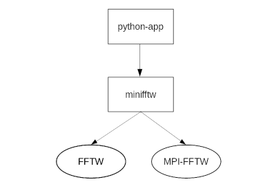

# Minimalistic MPI-FFTW

Continuous array FFTs with MPI.

This is a minimalistic Pythonwrapper for the MPI-FFTW. As every human
achievement, it is created out of hate for existing solutions.

Minimalistic means, that this wrapper will not wrapp every functionality the
FFTW offers. Probably just the 1D transforms.

This wrapper is tied to numpy and only accepts numpy arrays as payload.

Please note the following: MPI-FFTW only works as distributed memory FFT. This
means each node locally allocates *and  fill* the slice of the array to transform.
While FFTW will take care of synchronizing the work and computing valid results,
these results will be spread over all nodes, each only having a local slice of
the result.

The FFTW is not responsible for reassembling the array. That's why this wrapper
has been created: It is intended for users who want to transform arrays small
enough to fit into a single node's memory, but whose transforms are so work
intensive that MPI parallelization might still pay off.

**Keep in mind that when using with MPI, after executing a plan, only the process
with MPI rank 0 will have valid data.**

See the below section "MPI Distribution" for details.

(That's probably not what FFTW has been created for, since transforms are the
more efficient the larger the arrays are. But I don't care. Plus we needed this
for an internal research project.)

Compilation is also a bit tricky. Have a look at [mpi.md](./doc/mpi.md) for details.



Minifftw is a wrapper either around the fftw3, or fftw3-mpi, depending on how
you build it. It uses the FFTW in threaded mode, therefore resulting in hybrid
mode when using MPI. Of course, you could set the number of threads to one and
emulate the behavior of a pure MPI-FFTW.

Therefore, the great advantage is that you can use mfftw the same way for both
with and without MPI.


## Project Status

This project is work in progress and currently in beta state.
In my tests it computes valid results. Though you'd might want to check for
yourself before using it.

The API will most likely remain stable, though functions' behavior might change.

### Implemented FFTW functionality

- fftw\_init\_threads
- Wisdom import from filename
- Wisdom export to filename
- System-Wisdom import
- fftw\_init, with or without MPI
- fftw\_plan\_dft\_1d
- fftw cleanup routines


## List of supported Linux Clusters

- [Leibniz Rechenzentrum](./clusters/lrz/README.md), CoolMUC-2

Please send a patch if you want to see your cluster supported.


## Requirements

On your system, you'll need the following components:

- fftw3 C-library with header files
- fftw3\_mpi C-library with header files
- Numpy C-header files
- MPI implementation (i.e. openMPI) with header files

OpenMP (without 'I') is **not** required, as this wrapper uses the FFTW with
POSIX threads.

On a typical linux distro, the required packages might be called:

- libfftw3-mpi-dev
- python3-numpy
- libopenmpi-dev


## Building

### Conventional Targets

- `make normal` for a wrapper around the serial FFTW
- `make mpi` for a wrapper around the MPI-FFTW

### Linux Clusters

See in [clusters](./clusters/) for a list of the supported clusters. The folder also contains
sub-READMEs which are customized to the cluster and will hopefully help you
getting the wrapper to run on your target.

To build, run from the main folder:

`make <cluster>` or `make <cluster>-mpi`


## Usage

> See in [tests](./tests/) for examples.


### Functions

#### init

`minifftw.init(sys.argv, nr_of_threads)`

*Parameters:*

- sys.argv: List of strings
- nr\_of\_threads: Integer indicating the desired nr of threads used by FFTW

*Returns:* Py\_None

Init will initialize the FFTW and, if compiled with it, the MPI. Only when using
MPI you need to pass sys.argv, otherwise you could pass an empty list `[]`.
It is, however, recommended to always pass `sys.argv`

#### import\_system\_wisdom

`minifftw.import_system_wisdom()`

*Parameters:* None

*Returns:* None

Tries to import the system wisdom. Broadcasts it to the other processes when
using the MPI version.

Either rises an exception in case of an error or silently ignores the error (MPI).

#### import\_wisdom

`minifftw.import_wisdom(string_path_to_wisdom)`

*Parameters:*

- string\_path\_to\_wisdom: String-path specifying the file to import wisdom from.

*Returns:* None.

Tries to import wisdom from the specified filename. Either rises an exception
in case of an error, or silently ignores the error (MPI).

If build with MPI, this function also distributes the wisdom to all processes.


#### export\_wisdom

`minifftw.export_wisdom(string_path_to_store_to)`

*Parameters:*

- string\_path\_to\_store\_to: String-path specifying the file to store wisdom
to.

*Returns:* None.

Creates or overwrites the wisdom-file where the argument path points to.
Either rises an exception in case of an error, or silently ignores the error (MPI).

If build with MPI, this function gathers wisdom from all processes before storing.


#### plan\_dft\_1d

`plan = minifftw.plan_dft_1d(input_array, output_array, direction, flags)`

*Parameters:*

- input\_array: One dimensional Numpy-Array with dtype=numpy.complex128
- output\_array: One dimensional Numpy-Array with dtype=numpy.complex128
- direction: Either `minifftw.FFTW_FORWARD` or `minifftw.FFTW_BACKWARD`
- flags: FFTW flags, bitwise OR-interwined

Available flags are:

- FFTW\_ESTIMATE
- FFTW\_MEASURE
- FFTW\_PATIENT
- FFTW\_EXHAUSTIVE
- FFTW\_WISDOM\_ONLY
- FFTW\_DESTROY\_INPUT

*Returns:* minifftw-plancapsule (opaque data)

Note that the underlying FFTW function uses `int` to indicate the array's size,
therefore, on most platforms, you'll be limited to a maximum array size of
`2^31 - 1` (roughly two billion) complex numbers.


#### execute

`result = minifftw.execute(plan)`

*Parameters:*

- plan: minifftw-plancapsule as it is returned by `minifftw.plan_XXX(...)`

*Returns:*  New reference to output\_array from `minifftw.plan_XXX(...)`

When using with MPI, only the process with MPI-rank 0 will generate valid output.


#### get\_mpi\_rank

`rank = minifftw.get_mpi_rank()`

*Parameters*: None

*Returns*: The MPI-Rank (integer) of your application when build with MPI, 0 otherwise.

For convenience, this function also exists when you don't build for MPI usage.
So you don't have to change your code.

#### finit

`minifftw.finit()`

*Parameters*: None

*Returns*: None

Deallocates all resources used by FFTW and MFFTW. If built with the MPI
version, this function will **terminate all** your applications. This is done
due to some inconveniences described in [MPI](./doc/mpi.md).
So, make sure your simulation has stored its results and closed all file
descriptors prior to calling this function.


### Basics

``` Python3
import sys
import numpy as np
import minifftw as m

nr_of_threads = 8
data_len = 2048

m.init(sys.argv, nr_of_threads)

try:
	m.import_wisdom("my_wisdom_file")
	print("imported wisdom")
except:
	print("could not import wisdom")

data_in = np.zeros(data_len, dtype="complex128")
data_out = np.zeros(data_len, dtype="complex128")
p = m.plan_dft_1d(data_in, data_out, m.FFTW_FORWARD, m.FFTW_ESTIMATE)

# initialize data_in here

# the assignment is optional. mfftw.execute will fill data_out automatically
result = mfftw.execute(plan)

try:
	m.export_wisdom("my_wisdom_file")
	print("exported wisdom")
except:
	print("could not export wisdom")

# When using MPI, only rank 0 will have the valid result.
# When not using MPI, the rank function always returns 0.
if mfftw.get_mpi_rank() == 0:
	print(result)

# ...
mfftw.finit()
```

The first call (m.init()) is very important when using MPI: It will take your
environment and pass it to the MPI\_Init() function. Also, this function will
configure the number of threads the FFTW uses to heat up your machine.

**Like in pure C-FFTW, it's very important to initialize your array with your
actual payload data _after_ creating the plan.**

The plan function will prepare everything the FFTW needs to operate and pack
it into a python-capsule, which later has to be passed to all following
mfftw functions.

Once you are done transforming everything you wanted, call the finit() function
to terminate MPI properly. When building the MPI-version, finit() will terminate
*all* your processes. So, make sure you saved everything before this call.

> **Note**: You can and *should* call init() and finit() regardless whether you
use the MPI version or not. This way, you will never have to adjust your python
code when using this wrapper, even when you'll run it on a cluster.


## MPI Distribution

As hinted by the introduction, MFFTW uses a hacky trick to make FFTW easier to
use for end users.
Transparently for the user, it distributes the Lehnsherr process's array to the
Lehnsmann processes before executing, and collects the data again after executing.

This might turn out to be a bottleneck on some systems, since process 0 might be
busy with sending and receiving data a lot. On the other hand it completely frees
the user from having to deal with MPI manually.

*Example:*

Imagine you have an array of 4 million entries. You start your simulation on
4 MPI processes. This will happen:
1. In the beginning, all 4 processes will have the same array.
2. When executing a plan the process with ID 0 (Lehnsherr) will transmit 1
   million entries of his own array to every one of the 3 remaining processes,
   and he will keep the remaining one million entries for himself.
3. Each processes (including Lehnsherr) will copy the 1M entries to another local
	array (not visible for the python world) on which the FFTs will be executed.
4. After execution, the local copy is send back to the original input array of
	Lehnsherr, who keeps track which Lehnsmann process got which slice in
	the first place.
5. After an execution, therefore, only process with rank 0 has a valid array.

**You can execute as often as you want, but only the Rank 0 process will have
valid data in the end.**

You can handle this very easily i.e. this way:

```
out = mfftw.execute(plan)
if mfftw.get_mpi_rank() == 0:
	print(out)
```


### MPI Usage

Once the MPI wrapper is build for your target, there are only a few things to
keep in mind, which mostly do have to do with MPI itself, not the wrapper.

#### No Problems

All functions in this wrapper take MPI into account when being called by your
python code.

For example, `import_wisdom` will check if the calling process has
MPI rank 0. If it does, it will import the wisdom and broadcast it to your other
processes.

#### Usage


Tasks can be started as usual either with

```
mpiexec -np <N> python3 my_minifftw_simulation.py
```

or with a cluster manager (i.g. slurm) of your choice.


#### Performance

It is rather tricky to get the MPI-FFTW to run performantly. Have a look into
[mpi-performance](doc/mpi_performance.md) to get some tips about that.


### Important Notes

This wrapper applies a few tricks to make the usage of FFTW more easy for the
end user. This results in a few points which should be kept in mind.

Additionally, keep in mind that minifftw just wraps FFTW – so the behavior
documented for the FFTW will mostly also apply to this wrapper. For instance,
the planner-functions will overwrite your input array with arbitrary data, so
you should fill them with your payload once planing is completed.

#### Plan Capsules

`mfftw.plan_XXX` returns a python capsule (opaque data) which encapsulates
the fftw data types, including the fftw\_plan and a reference to your numpy arrays.

Note the following:

- Once the plan is created, you must not reallocate your numpy-array, nor change
its length. Violating this rule might result in undefined behavior.
- A plan and the underlying memory (except if there are other references to the
numpy arrays) gets freed once the plan gets out of scope
(rather: is garbage collected). You could enforce this with `del(my_plan)`.
- The capsule contains a reference to your numpy-array. Therefore, the array can
not be garbage collected until the plan-capsule gets dropped.

#### Inplace Transforms and Overwriting

If input\_array and output\_array are identical, the wrapper resp. the fftw will
perform an inplace transform, hence overwriting your original array.

Additionally, FFTW offers you the opportunity to pass two different arrays, but
allow the library to overwrite your input-array anyways. This might help the
FFTW gain performance. To enable this mode, pass `minifftw.FFTW_DESTROY_INPUT`
as a flag in the plan creation functions.


## TODO

- Think about exposing more of the API to the user, especially more transforms

## License

 Copyright 2020, 2021 Philipp Stanner, `<stanner@posteo.de>`

 This program is free software: you can redistribute it and/or modify
 it under the terms of the GNU General Public License as published by
 the Free Software Foundation, either version 3 of the License, or
 (at your option) any later version.

 This program is distributed in the hope that it will be useful,
 but WITHOUT ANY WARRANTY; without even the implied warranty of
 MERCHANTABILITY or FITNESS FOR A PARTICULAR PURPOSE.  See the
 GNU General Public License for more details.

 You should have received a copy of the GNU General Public License
 along with this program. If not, see `<http://www.gnu.org/licenses/>`.

