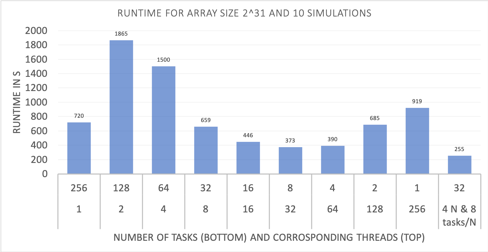

# Increase the FFTW's performance using MPI

Parallelization is hard. Just starting the same simulation with more nodes will
result in surprisingly slow results, if you do not keep a few things in mind.

It is important to understand that the speed of a simulation depends on the size
of the transformed array, the number of nodes, the total number of mpi-processes
and the number of processes per node. Also, the number of threads per process
may play a role.

## FFTW's tips

Among others, the FFTW documentation states these rules:

1. “As a general rule, you don’t want to use more threads than you have processors. (Using
more threads will work, but there will be extra overhead with no benefit.) In fact, if the
problem size is too small, you may want to use fewer threads than you have processors.”
2. “Distributed-memory parallelism is especially useful when you are transforming arrays so
large that they do not fit into the memory of a single processor. The storage per-process
required by FFTW’s MPI routines is proportional to the total array size divided by the
number of processes. Conversely, distributed-memory parallelism can easily pose an un-
acceptably high communications overhead for small problems; the threshold problem size
for which parallelism becomes advantageous will depend on the precise problem you are
interested in, your hardware, and your MPI implementation.”

## Rule of thumb

During our work on the LRZ clusters, we were given the following tip:
On one node, start so many MPI processes that the array fills at least half of
the memory available per process on this node.

So, if your node has 40GB of RAM available and your array is 1GB large, you should
at least start 20 MPI processes. Distributing these processes among more nodes
might then further speed up your transform. 

The graphics shows how the runtimes for a simulation might become quite terrible
when too few or too many MPI processes are used, compared to a transform using
just one node (or the FFTW without MPI).
